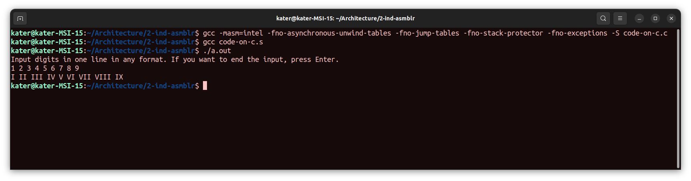

# Архитектура вычислительных систем. ИДЗ №2.

### Вариант 8. Разработать программу, заменяющую все цифры (за исключением нуля) в заданной ASCII-строке римскими цифрами. То есть, соответствующим комбинациями букв для цифр от 1 до 9.

#### Выполнил Старцев Евгений, БПИ219.

---

## Решение на 4 балла.

- ### Приведено решение задачи на C на планируемую оценку - `выполнено`

Решение представлено в файле [code-on-c.c](code-on-c.c)

- ### В полученную ассемблерную программу, откомпилированную без оптимизирующих и отладочных опций, добавлены комментарии, поясняющие эквивалентное представление переменных в программе на C - `выполнено`

Ассемблерная программа получается из программы на C с помощью команды `gcc -masm=intel -S code-on-c.c` (опция
`-masm=intel` необходима для получения ассемблерного кода с синтаксисом Intel, она не является ни оптимизирующей, ни
отладочной). Исходный код с необходимыми комментариями находится в
файле [code-on-assembly-unmodified.s](code-on-assembly-unmodified.s). Покажу
некоторые эквивалентные представления переменных в программе на С в отчёте.

Строки 43-46:

```asm
	cmp	DWORD PTR -4[rbp], 49   # ascii 49 - 1
	je	.L2
	cmp	DWORD PTR -4[rbp], 50   # ascii 50 - 2
	je	.L2
```

В этих строках заметим, что идёт проверка на то, является ли переменная каким-то символом из таблицы ASCII. Если да, то
происходит переход в `.L2`.

Строка 72:

```asm
	lea	rdx, input.2[rip]   # input - array of chars
```

В этой строке происходит обращение к массиву input. Кстати, замечено, что размер массива input задан в 333 строке:

Строки 332-333:

```asm
	.local	input.2
	.comm	input.2,1000,32     # size of static char input[1000] (in input_numbers)
```

Ещё посмотрим на строки 111-112 - переменные `index` и `index_of_input` из метода `convert_to_rome`:

```asm
	mov	DWORD PTR -8[rbp], 0    # int index = 0
	mov	DWORD PTR -4[rbp], 0    # int index_of_input = 0;
```

- ### Из ассемблерной программы убраны лишние макросы за счет использования соответствующих аргументов командной строки и/или за счет ручного редактирования исходного текста ассемблерной программы - `выполнено`

Лишние макросы были убраны за счёт использования аргументов командной строки. Итоговая команда для получения такой
ассемблерной программы выглядит следующим образом:

```
gcc -masm=intel -fno-asynchronous-unwind-tables -fno-jump-tables -fno-stack-protector -fno-exceptions -S code-on-c.c
```

где `-fno-asynchronous-unwind-tables` отключает генерацию отладочной информации, `-fno-jump-tables` отключает
jump-таблицы, `-fno-stack-protector` отключает стековый индикатор, `-fno-exceptions` для более корректной работы с
исключениями.

Исходный код модифицированной программы находится в файле [code-on-assembly.s](code-on-assembly.s).

- ### Модифицированная ассемблерная программа отдельно откомпилирована и скомпонована без использования опций отладки - `выполнено`

Ассемблерная программа откомпилирована и скомпонована с помощью
команды ``gcc <название файла с ассемблерной программой>``. Прикреплю скриншот выполнения.



- ### Представлено полное тестовое покрытие, дающее одинаковый результат на обоих программах. Приведены результаты тестовых прогонов для обоих программ, демонстрирующие эквивалентность функционирования - `выполнено`

Обе программы (программа на C и модифицированная программа на ассемблере) были протестированы на одинаковом наборе
тестов, представленном ниже. Обе программы работают одинаково. Все скриншоты, демонстрирующие корректность, есть в
репозитории (файлы test<номер теста>.png).

Комментарий ко всем тестам - программа работает корректно только если введены цифры от 1 до 9 с пробелами или без. В
случае, если вводится 0 или любой другой символ, программа будет выводить `Incorrect input!`. Во всех корректных случаях
ввода программа выводит римские цифры через пробел.

### Тест 1

Ввод:

```
1 2 3 4 5 6 7 8 9
```

Вывод:

```
I II III IV V VI VII VIII IX
```

### Тест 2

Ввод:

```
123456789
```

Вывод:

```
I II III IV V VI VII VIII IX
```

### Тест 3

Ввод:

```
1 2 3 0
```

Вывод:

```
Incorrect input!
```

### Тест 4

Ввод:

```
new 1 2 3
```

Вывод:

```
Incorrect input!
```

### Тест 5

Ввод:

```
5 6 4 3 7 2 88
```

Вывод:

```
V VI IV III VII II VIII VIII  
```

### Тест 6

Ввод:

```
56435683543
```

Вывод:

```
V VI IV III V VI VIII III V IV III
```

### Тест 7

Ввод:

```
9 9 9 9 9 8 8 8 8 8
```

Вывод:

```
IX IX IX IX IX VIII VIII VIII VIII VIII
```

### Тест 8

Ввод:

```
10
```

Вывод:

```
Incorrect input!
```

### Тест 9

Ввод:

```
799  743
```

Вывод:

```
VII IX IX VII IV III  
```

### Тест 10

Ввод:

```
11111111111111
```

Вывод:

```
I I I I I I I I I I I I I I
```

- #### Сформирован отчет с результатами тестовых прогонов и описанием используемых опций компиляции, проведенных модификаций ассемблерной программы - `выполнено`

Отчёт вы читаете прямо сейчас:)

## Решение на 5 баллов.

- ### В реализованной программе необходимо использовать функции с передачей данных через параметры - `выполнено`

Реализованные функции:

- `char *input_numbers()` - функция для ввода чисел в консоли. Возвращает массив из введённых символов.
- `char *convert_to_rome(const char *digits)` - функция, конвертирующая массив цифр в римские. Возвращает массив
  символов - полученных римских цифр.

Содержимое функций смотрите в файле с кодом на С.

- ### Использовать локальные переменные - `выполнено`

В коде не было использовано ни одной глобальной переменной (смотрите файл с кодом на C).

- ### В ассемблерную программу при вызове функции добавить комментарии, описывающие передачу фактических параметров и перенос возвращаемого результата - `выполнено`

Так получилось, что в программе на С функция с передаваемыми параметрами всего одна (и параметр тоже один). Часть кода
на ассемблере с комментариями представлена ниже:

```asm
	mov	QWORD PTR -24[rbp], rdi # const char *digits - переданный параметр, кладётся в rdi
	mov	DWORD PTR -4[rbp], 0    # int index = 0 - параметр, инициализированный в функции
	mov	DWORD PTR -8[rbp], 0    # int index_of_input = 0 - параметр, инициализированный в функции
```

Перенос возвращаемого результата происходит в строках 280-282:

```asm
	lea	rax, output.0[rip]  # перенос результата
	pop	rbp
	ret     # выход из функции
```

- ### В функциях для формальных параметров добавить комментарии, описывающие связь между параметрами языка Си и регистрами (стеком) - `выполнено`

Пример регистров - `eax`, `ebx`, `asi`, `rsi`, `rdi` и т.д.

Функций в данной программе немного, а с передаваемым параметром всего одна, поэтому возьмём строки кода 97-99:

```asm
	mov	QWORD PTR -24[rbp], rdi # const char *digits - переданный параметр, кладётся в rdi
	mov	DWORD PTR -4[rbp], 0    # int index = 0 - параметр, инициализированный в функции
	mov	DWORD PTR -8[rbp], 0    # int index_of_input = 0 - параметр, инициализированный в функции
```
  
На данном примере видно, что значение `const char *digits` кладётся в `rdi`. Переменным `index` и `index_of_input`
присваивается значение 0.

- ### Информацию о проведенных изменениях отобразить в отчете - `выполнено`

Отчёт вы читаете прямо сейчас:)